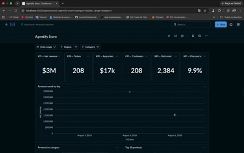
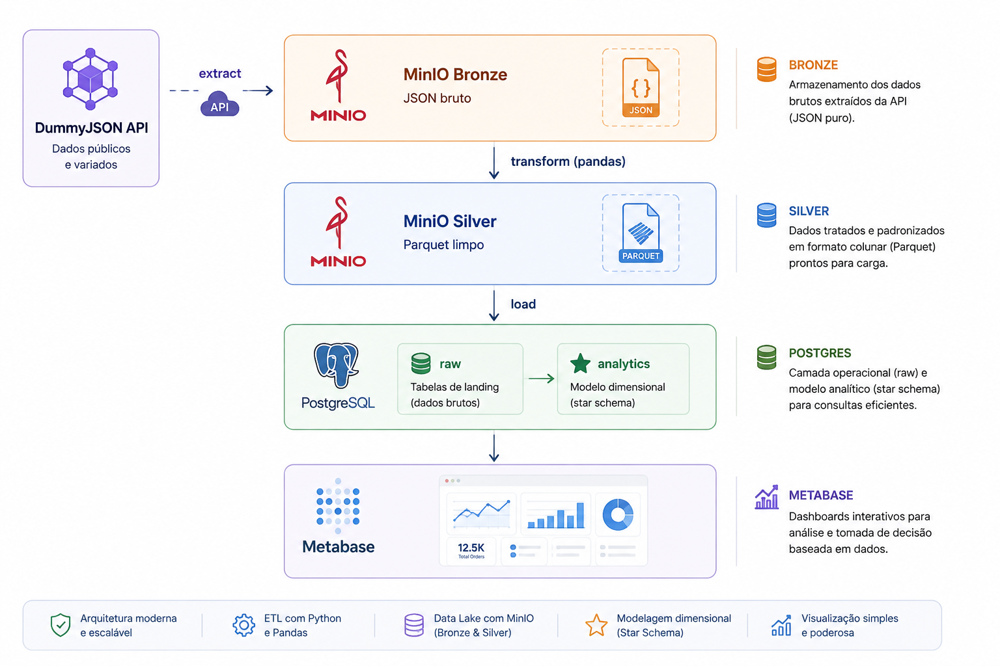

# E-commerce Analytics Platform

[Português](#português) | [English](#english)


---

## Português

### O que este projeto resolve

Se você tem dados de vendas, produtos ou clientes espalhados (numa API,
numa planilha, num sistema legado) e quer tomar decisão em cima disso sem
depender de alguém rodando uma query toda vez, é isso que eu entrego: um
pipeline que busca o dado bruto, deixa ele limpo e modelado, e entrega um
painel pronto para você mesmo explorar.

Este repositório é a prova disso em código, rodando de ponta a ponta
contra uma API real (a [DummyJSON](https://dummyjson.com), simulando um
e-commerce com produtos, carrinhos e clientes). Não é um notebook solto
nem uma query avulsa. É a mesma estrutura que eu uso em projeto de
cliente:

1. **Coleta automatizada.** Nada de copiar e colar CSV. Um cliente HTTP
   com paginação e retry busca os dados direto da fonte.
2. **Dado bruto preservado.** Tudo que a fonte devolveu fica guardado sem
   alteração num data lake (MinIO), particionado por data. Se um
   requisito mudar amanhã, o histórico bruto está disponível para
   reprocessamento.
3. **Dado limpo e padronizado.** Nomes de coluna, tipos e campos
   sensíveis são tratados antes de qualquer análise acontecer.
4. **Modelo analítico pronto para BI.** Um data warehouse (PostgreSQL)
   modelado em star schema, com histórico de mudanças de cliente
   preservado (SCD2), pronto para qualquer ferramenta plugar.
5. **Você explora sozinho.** O Metabase fica conectado direto no
   warehouse. Você monta seus próprios dashboards, sem depender de um
   relatório novo a cada semana.

Cada etapa tem log e auditoria (`audit.pipeline_runs`), com registro de
quando o pipeline rodou, quantas linhas processou e se algo falhou. Não é
uma caixa-preta.

### Arquitetura



### Decisões de design

- **Arquitetura medallion (bronze/silver) no MinIO.** Bronze é uma zona
  de pouso imutável, particionada por data, com exatamente o que a API
  devolveu. Silver é tipado, padronizado, sem dados duplicados e sem campos
  sensíveis. Cada etapa lê a saída da etapa anterior direto do object
  storage (não em memória), então qualquer etapa pode ser reprocessada
  isoladamente para uma `ingestion_date` específica.
- **Schema `raw` no Postgres** espelha o silver em snapshot completo
  (truncate e reload a cada execução). A DummyJSON não tem capacidade
  incremental, então não há o que anexar.
- **Schema `analytics`** é um star schema estilo Kimball: `dim_customer`
  (SCD Tipo 2, versionado quando endereço ou segmento muda), `dim_product`
  (Tipo 1, sobrescrito), `dim_date` e `fact_orders` (grão: uma linha de
  produto dentro de um carrinho).
- **`audit.pipeline_runs`** registra toda execução do pipeline (status,
  contagem de linhas, mensagem de erro) para observabilidade básica e auditoria.
- **Metabase** como camada de BI self-service, para que o cliente final
  não precise saber SQL nem depender de um relatório sob demanda.

### Premissas documentadas

Os dados da DummyJSON são sintéticos e não mapeiam perfeitamente para um
domínio real de e-commerce:

- **Sem data ou status real de pedido.** Cada carrinho é tratado como um
  pedido concluído, datado pela `ingestion_date` do próprio pipeline, e
  não por uma data de negócio inventada.
- **Sem segmento ou tier real de cliente.**
  `dim_customer.customer_segment` é uma faixa etária simples, calculada
  em SQL, claramente separável do dado de origem.
- **Campos de PII são descartados, não propagados.** Os
  usuários fake da DummyJSON trazem senha, CPF, número de cartão e
  carteira cripto. Nada disso é escrito na camada silver ou no
  warehouse. É o mesmo princípio aplicado a PII real em produção.

### Estrutura do projeto

```
etl/
  config.py            # endpoints, configs de Postgres/MinIO (via .env)
  extract/              # cliente HTTP da DummyJSON (paginação e retry) e extratores
  storage/               # cliente MinIO para leitura/escrita bronze/silver
  transform/              # limpeza e padronização bronze -> silver por entidade
  load/                    # loader do raw, upserts de dimensão/fato, auditoria
  pipeline.py              # orquestra extract -> bronze -> silver -> load
main.py                     # entrypoint de linha de comando
database/init/               # DDL do schema Postgres (roda automático no 1º start)
analysis/
  sql/                          # perguntas de negócio em SQL para plugar no Metabase
tests/                          # testes unitários da camada de transformação
```

### Setup

Requer Docker, Python 3.11+ e [uv](https://docs.astral.sh/uv/).

```bash
cp .env.example .env        # já vem com defaults funcionais para local
docker compose up -d        # sobe Postgres, MinIO, pgAdmin e Metabase
uv sync --extra dev
```

Se o Postgres já tinha sido inicializado antes de
`database/init/04-create-raw-tables.sql` existir, aplique manualmente
(scripts de init só rodam num volume de dados vazio):

```bash
docker exec -i analytics_postgres psql -U analytics_admin -d analytics_dw \
  < database/init/04-create-raw-tables.sql
```

### Rodando o pipeline

```bash
uv run python main.py                     # execução completa para hoje (UTC)
uv run python main.py --date 2026-08-01   # backfill de uma data específica
```

Rodar os testes:

```bash
uv run pytest
```

### Explorando o resultado

- **Metabase**: http://localhost:3000. Conecte no Postgres (`analytics_dw`)
  na primeira execução e monte seus painéis. Passo a passo em
  [`analysis/README.md`](analysis/README.md).
- **pgAdmin**: http://localhost:5050 (credenciais no `.env`).
- **MinIO console**: http://localhost:9001 (credenciais no `.env`).
  Navegue direto pelos buckets `bronze` e `silver`.
- **Perguntas de negócio em SQL**: `analysis/sql/*.sql`.

### Serviços (`compose.yml`)

| Serviço  | Função                                | Porta |
|----------|----------------------------------------|-------|
| postgres | Data warehouse analítico                | 5432  |
| pgadmin  | UI web do Postgres                       | 5050  |
| minio    | Data lake S3-compatible                    | 9000 (API), 9001 (console) |
| metabase | BI self-service para o cliente final          | 3000  |

---

## English

### What this project solves

If you have sales, product or customer data scattered across an API, a
spreadsheet or a legacy system, and want to make decisions on top of it
without depending on someone running a query every time, this is what I
deliver: a pipeline that fetches the raw data, cleans and models it, and
hands you a dashboard ready for you to explore on your own.

This repository is proof of that in code, running end to end against a
real API ([DummyJSON](https://dummyjson.com), simulating an e-commerce
store with products, carts and users). It is not a loose notebook or a
one-off query. It is the same structure I use on client projects:

1. **Automated collection.** No copy-pasting CSVs. An HTTP client with
   pagination and retry fetches the data straight from the source.
2. **Raw data preserved.** Everything the source returned is kept
   unchanged in a data lake (MinIO), partitioned by date. If a
   requirement changes tomorrow, the raw history is there to reprocess.
3. **Clean, standardized data.** Column names, types and sensitive
   fields are handled before any analysis happens.
4. **Analytics-ready model for BI.** A data warehouse (PostgreSQL)
   modeled as a star schema, with customer change history preserved
   (SCD2), ready for any tool to plug into.
5. **You explore on your own.** Metabase connects directly to the
   warehouse. You build your own dashboards, without depending on a new
   report every week.

Every stage is logged and audited (`audit.pipeline_runs`), recording
when the pipeline ran, how many rows it processed and whether anything
failed. It is not a black box.

### Architecture


### Design decisions

- **Medallion architecture (bronze/silver) on MinIO.** Bronze is an
  immutable landing zone, partitioned by date, holding exactly what the
  API returned. Silver is typed, flattened, deduplicated and stripped of
  sensitive fields. Each stage reads the previous stage's output
  straight from object storage (not in memory), so any stage can be
  rerun independently for a given `ingestion_date`.
- **The `raw` schema in Postgres** mirrors silver as a full snapshot
  (truncate and reload on every run). DummyJSON has no incremental
  capability, so there is nothing to append.
- **The `analytics` schema** is a Kimball-style star schema:
  `dim_customer` (SCD Type 2, versioned when address or segment
  changes), `dim_product` (Type 1, overwritten in place), `dim_date` and
  `fact_orders` (grain: one product line within one cart).
- **`audit.pipeline_runs`** records every pipeline run (status, row
  counts, error message) for basic observability.
- **Metabase** as the self-service BI layer, so the end client does not
  need to know SQL or depend on an on-demand report.

### Documented assumptions

DummyJSON's data is synthetic and does not map perfectly onto a real
e-commerce domain:

- **No real order date or status.** Each cart is treated as a completed
  order, dated by the pipeline's own `ingestion_date`, not a fabricated
  business date.
- **No real customer segment or tier.**
  `dim_customer.customer_segment` is a simple age bracket, computed in
  SQL, clearly separable from the source data.
- **PII-shaped fields are dropped, not carried downstream.** DummyJSON's
  fake users include a password, SSN, card number and crypto wallet.
  None of that is written to the silver layer or the warehouse. It is
  the same principle applied to real PII in production.

### Project layout

```
etl/
  config.py            # endpoints, Postgres/MinIO settings (via .env)
  extract/              # DummyJSON HTTP client (pagination and retry) and extractors
  storage/               # MinIO client for bronze/silver read-write
  transform/              # bronze -> silver cleaning/flattening per entity
  load/                    # raw loader, dimension/fact upserts, audit logging
  pipeline.py              # orchestrates extract -> bronze -> silver -> load
main.py                     # CLI entrypoint
database/init/               # Postgres schema DDL (auto-runs on first start)
analysis/
  sql/                          # SQL business questions to plug into Metabase
tests/                          # unit tests for the transform layer
```

### Setup

Requires Docker, Python 3.11+ and [uv](https://docs.astral.sh/uv/).

```bash
cp .env.example .env        # already ships with working local defaults
docker compose up -d        # starts Postgres, MinIO, pgAdmin and Metabase
uv sync --extra dev
```

If Postgres was already initialized before
`database/init/04-create-raw-tables.sql` existed, apply it manually
(init scripts only run against an empty data volume):

```bash
docker exec -i analytics_postgres psql -U analytics_admin -d analytics_dw \
  < database/init/04-create-raw-tables.sql
```

### Running the pipeline

```bash
uv run python main.py                     # full run for today (UTC)
uv run python main.py --date 2026-08-01   # backfill a specific date
```

Run the tests:

```bash
uv run pytest
```

### Exploring the results

- **Metabase**: http://localhost:3000. Connect to Postgres
  (`analytics_dw`) on first run and build your own dashboards. Step by
  step in [`analysis/README.md`](analysis/README.md).
- **pgAdmin**: http://localhost:5050 (credentials in `.env`).
- **MinIO console**: http://localhost:9001 (credentials in `.env`).
  Browse the `bronze` and `silver` buckets directly.
- **SQL business questions**: `analysis/sql/*.sql`.

### Services (`compose.yml`)

| Service  | Purpose                             | Port |
|----------|---------------------------------------|------|
| postgres | Analytical data warehouse               | 5432 |
| pgadmin  | Postgres web UI                          | 5050 |
| minio    | S3-compatible data lake                    | 9000 (API), 9001 (console) |
| metabase | Self-service BI for the end client              | 3000 |
